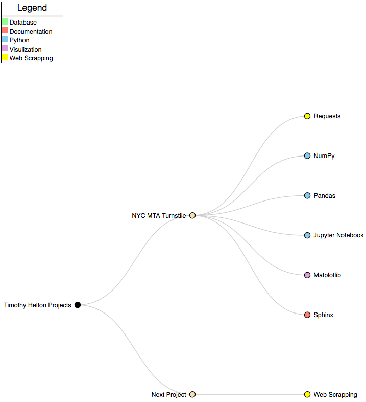

# Mentor Session 02 Agenda

#### April 20, 7:00am (45 Minutes)

[Data Science Conversation](#ds_converstation)

[Status Update](#status_update)

[Technical Questions](#technical_questions)

[Notes](#notes)

---
###  Data Science Conversation (10 minutes)
- Blog: [The mathematics of machine learning](https://medium.com/towards-data-science/the-mathematics-of-machine-learning-894f046c568)
- Blog: [The real prerequisite for machine learning isn't math, it's data analysis](https://www.r-bloggers.com/the-real-prerequisite-for-machine-learning-isnt-math-its-data-analysis/)
    - With respect to data science what mathematical areas should receive:
        - top priority?
        - medium priority?
        - low priority? 

[Table of Contents](#toc)

---
###  Status Update
- Math Module
    - Completed K2 Titanic exercises
    - Completed K2 Linear Algebra exercises
    - Completed K2 Calculus exercises
    - Khan Academy Linear Algebra content
        - Vectors: 9 of 45
- Created Project D3 interactive flair graphic
    - Summarize tools used for each project

[Table of Contents](#toc)

---
###  Technical Questions
- Continue project discussion 

[Table of Contents](#toc)

---
###  Notes
- Next Week's Data Science Conversation: Find Blog
- Try to send out on Monday

#### Math Applications for Data Science
- 40% Algorithms
- 35% Probability Statistics

To Develop New Models
- Calculus (Machine Theory optimization)
- Linear Algebra

#### Host D3 Graphics on GitHub
GitHub IO
- Host web pages

#### Think of topics for project
- Avoid the use to easily procured data sets
- Find topic that requires web scraping and database creation

[Table of Contents](#toc)

